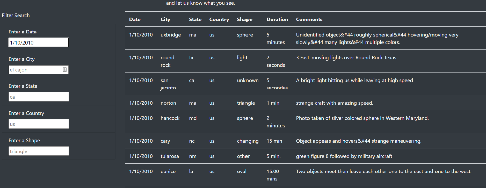
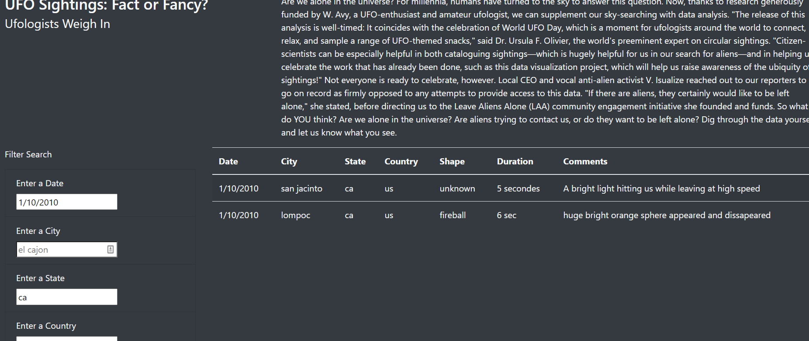
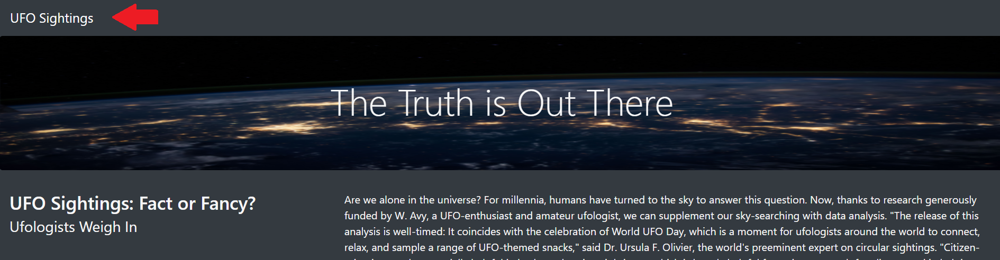

# UFOs

 

## Overview

In this project we are building a website with a table to organize UFO data that is stored as a JavaScript array. 
In order to provide a more in-depth analysis of UFO sightings, we will allow users to filter for multiple criteria at the same time. In addition to the date, you will be able to filter table for the city, state, country, and shape.

## Results

Deployed UFO page:

https://russellshelley.github.io/UFOs/

- On our page we are now presented with five filter inputs. All with placeholder texts. That help guide the user to our datas format.

- When input is detected in one of the boxes. The data in the table will automatically filter to return correct data. For example, here I want to learn about sightings on January 10th 2010, so I entered 1/10/2010 in the date filter. 

- Further filters can be utilized to further narrow down the data. I am interested in California, so here I have added "ca" to our state filter, and the results are further refined and now match both my date and state choices.

- Filters can continue to be added in this way further refining the presented data.

- Our code has an event that listens for the inputs. When they are detected they are stored as an object. Our filterTable function is then looping through the table data checking for matches to the stored object and any matched data is returned in the table via the buildTable function. As this is repeated the data in table is refined.

- Our table can be reset by clicking the "UFO Sightings" in the Nav bar at the top of the page.

## Summary

- We now have a website multiple filters allowing the user to search for very specific results within our data.
I can still see a problem arising when the user does not know the correct input to use to filter our data.  For example, when searching by shape would a user know to use the term fireball? Or sphere instead of spherical? When searching for a city the user may miss the clue provided by the placeholder text to only use lower case.
- One way to address this could be with a dropdown list that appears when using the shape text box. This will work best if we do not have too many options.
- It would also be nice if we added code to so our filters ignore case when matching results.  This would prevent user frustration.

